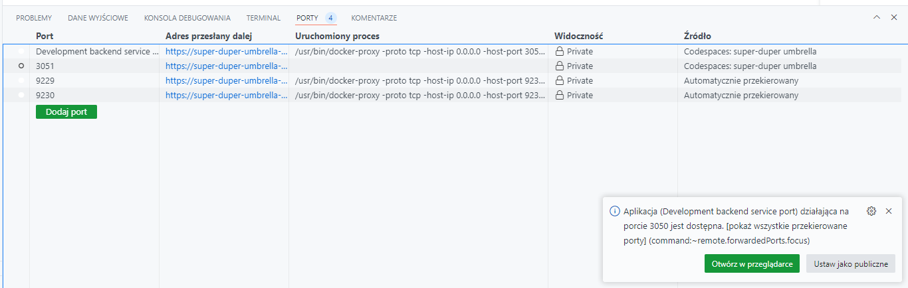

# Rekrutacja Ajinware - System Kolejek Górskich

* [Wprowadzenie](#wprowadzenie)
* [Moja interpretacja zadania rekrutacyjnego](#moja-interpretacja-zadania-rekrutacyjnego)
  + [System](#system)
  + [Replikacja](#replikacja)
  + [Środowisko pracy](#środowisko-pracy)
  + [Logika biznesowa](#logika-biznesowa)
* [Wybór technologii](#wybór-technologii)
  + [Najważniejsze pytanie: dlaczego wybrałem **NestJS**?](#najważniejsze-pytanie-dlaczego-wybrałem-nestjs)
  + [CQRS](#cqrs)
  + [Devcontainer](#devcontainer)
* [Środowisko deweloperskie](#środowisko-deweloperskie)
  + [Pierwsze kroki](#pierwsze-kroki)
  + [Struktura folderów](#struktura-folderów)
  + [Preferowany edytor kodu](#preferowany-edytor-kodu)
  + [Projekt uruchomiony, co dalej?](#projekt-uruchomiony-co-dalej)
    - [Github Codespaces](#używając-github-codespaces-musimy-użyć-zakładki-porty-żeby-dowiedzieć-się-pod-jakim-adresem-nasz-port-został-wystawiony)
* [Struktura backendu](#struktura-backendu)
* [Checklista z zadania rekrutacyjnego](#checklista-z-zadania-rekrutacyjnego)

<small><i><a href='http://ecotrust-canada.github.io/markdown-toc/'>Table of contents generated with markdown-toc</a></i></small>

## Wprowadzenie

To repozytorium zawiera rozwiązanie zadania rekrutacyjnego na stanowisko Backend Developer w firmie Ajinware.

Możliwe, że trochę przesadziłem z tym rozwiązaniem, ale chciałem pokazać, że potrafię zrobić coś więcej niż tylko zaimplementować API.

Zanim przejdziemy do opisu rozwiązania, muszę zaznaczyć, że specyfikacja zadania była w wielu miejscach nie jasna, a nawet sprzeczna. W związku z tym, w niektórych miejscach musiałem podjąć decyzje, które mogą być niezgodne z oczekiwaniami. Dlatego pierwszą rzeczą, którą opiszę, będzie moja interpretacja zadania.

## Moja interpretacja zadania rekrutacyjnego

Jeżeli o czymś nie wspomniałem, oznacza to że instrukcje były jasne i starałem się ich trzymać.

### System
- System ma udostępniać API, które pozwala zarządzać kolejkami górskimi, personelem i wagonikami
- System ma umożliwiać uruchomienie węzła w trybie offline (bez redisa) jak i online (z redisem)
- System potrafi pracować w trybie klastra, gdzie jeden węzeł jest liderem a reszta followerami
- Klaster działa tak, że jeden węzeł zapisuje dane i dba o spójność systemu generując ID w bazie danych a reszta węzłów może służyć za repliki do odczytu danych implementujące strategię `eventual consistency`

### Replikacja
- Operacje modyfikujące bazę danych mają być przeprowadzane z węzła lidera, a węzły-followery mają uniemożliwiać w jakiś sposób użycie swojego api do modyfikacji bazy danych (dodawania i edycji kolejek oraz wagoników)
- Każdy węzeł ma odrębną bazę danych która ma być replikowana z węzła-lidera na węzły-followery
- Podczas dołączania do klastra, baza danych dołączającego węzła ma być zsynchronizowana z resztą klastra
- Replikacja dzieje się asynchronicznie i nie blokuje działania aplikacji
- Węzeł który replikuje swoją bazę danych, nie jest dostępny z zewnątrz (implementacja poprzez healthchecki)

### Środowisko pracy
- Logi wyświetlane są na konsoli oraz zapisywane do plików logów
- Poziom logowania różni się w zależności od środowiska (produkcyjnego/deweloperskiego)
- Produkcja uruchamia się na 3051 a development na 3050
- Wszystkie usługi danego środowiska dostępne są z danego portu poprzez proxy (żeby udostępnić wiele serwerów pod jednym portem)
- Systemy produkcyjne jak i deweloperskie nie kolidują ze sobą ani w redisie, ani nie nadpisują sobie logów czy baz danych
- Niestety, decydując się na użycie devcontainera pozbawiłem się możliwości zablokowania dostępu do środowiska deweloperskiego dla osób z zewnątrz, **JEDNAKŻE** używając devcontainera w Github Codespaces, github pozwala na wybranie czy dany port ma być publiczny, czy prywatny (chroniony credentialsami z naszego githuba)

### Logika biznesowa
- Każda kolejka ma jedną określoną prędkość wagoników, bo inaczej wagoniki **zderzałyby się ze sobą na trasie** albo musiałyby zwolnić do prędkości najwolniejszego wagonika
- Statystyki i monitorowanie muszą być zaimplementowane tak, żeby możliwa była obserwacja systemu w czasie rzeczywistym
- Statystyki i monitorowanie **nie mogą** być zaimplementowane w logach serwera (bo kolidują z resztą logów a i użyteczność żadna)
- System informuje o brakującej liczbie miejsc dla klientów i pokazuje oczekiwaną ilość, bo wagoniki mają różną liczbę siedzeń a nie jedną statyczną wartość co uniemożliwia pokazanie ilości brakujących wagoników

> Dodam też, że bardziej skupiałem się raczej na technologii niż na przeanalizowaniu działania systemu, bo z tonu zadania zrozumiałem, że to właśnie klastrowanie, wybieranie lidera i synchronizacja są ważnym elementem. W realnym życiu obie te kwestie są bardzo ważne, więc proszę mieć na uwadze, że wiem, że mogłem lepiej przeanalizować część produktową zadania.

## Wybór technologii

### Najważniejsze pytanie: dlaczego wybrałem **NestJS**?

Z doświadczenia wiem, że użycie frameworka jest dobrą praktyką, jako że frameworki rozwiązują część problemów z którymi się stykamy my programiści, jak i również usprawniają komunikację w zespole oferując wspólne API programistyczne. Dodatkową zaletą użycia frameworka jest to, że dobrze użyty upraszcza strukturę rozwiązania, gdzie pisząc własne rozwiązanie od zera cięzko jest zadbać o to żeby struktura była przejrzysta dla programistów.

Mogłem tutaj użyć też express.js czy innego frameworka i zapewniam że potrafię budować rzeczy od zera bez frameworków (stąd moje doświadczenie o którym wspomniałem wyżej) jednak zdecydowałem że łatwiej rekruterowi będzie zrozumieć jak działa kod kiedy po prostu użyję NestJS.

### CQRS

Zdecydowałem się użyć wzorca Command Query Responsibility Segregation do zbudowania archtektury zdarzeniowej wewnątrz aplikacji, która przyjemnie integruje się z rozwiązaniem, jako że przez Redisa przepływają głównie zdarzenia synchronizacyjne klastra.

### Devcontainer

Użyłem tutaj standardu devcontainer, żeby zdefiniować środowisko deweloperskie w formie dockerowego kontenera.

Środowisko ułatwia start z projektem, bo nie trzeba instalować i konfigurować narzędzi na swoim własnym komputerze a dodatkowo pozbywamy się komplikacji w postaci walki z mnogością systemów na których pracują deweloperzy.

Devcontainer posiada rozszerzenie docker-in-docker, więc wewnętrzna instancja dockera jest w pełni odizolowana od dockera-hosta.

## Środowisko deweloperskie

[](https://codespaces.new/thebartekbanach/ajinware-recruitment)

Można użyć przycisku powyżej. Uruchomi on instancję Devcontainera na Github Codespaces, więc nie trzeba nawet klonować repozytorium na własny komputer.

Opcją alternatywną może być sklonowanie repozytorium za pomocą [DevPod'a](https://devpod.sh/), stworzyłem całe rozwiązanie pracując w devcontainerze właśnie za pomocą devpoda.

Projekt powinien też wstać lokalnie bez użycia devcontainera.

### Pierwsze kroki

Pierwsze kroki, po uruchomieniu:
- `npm i` - instalacja paczek projektu
- `task infra:offline:dev:start` - uruchomienie pojedynczego węzła w trybie offline używając `docker-compose`
- `task infra:cluster:dev:start` - uruchomienie klastra w trybie deweloperskim przy użyciu docker-compose`

> Uwaga: nie ma potrzeby uruchamiania redisa za pomocą komendy `task infra:redis:start`, **każda komenda wymagająca redisa sama upewnia się, że redis jest uruchomiony**

Przydatną komendą będzie:
```shell
task # lists all available tasks

# The result of this command is:
# * infra:cluster:dev:start:        Start the development cluster
# * infra:cluster:prod:start:       Start the production cluster
# * infra:compose:cleanup:          Stop and remove all dev and prod containers, except redis
# * infra:offline:dev:start:        Start the development offline server
# * infra:offline:prod:start:       Start the production offline server
# * infra:redis:start:              Start the redis server in background
# * infra:redis:stop:               Stop the redis server
```

Komendy w `task` pozwalają uruchomić pojedynczy węzeł w trybie offline lub klaster w trybach deweloperskim oraz produkcyjnym.

### Struktura folderów
- `./infra` - zawiera pliki konfiguracyjne docker-compose i inne dla środowisk `dev` oraz `prod`
- `./data` - folder w którym zapisywane są bazy danych i logi węzłów
  - `./dev/offline`
  - `./dev/cluster/node-1`
  - `./dev/cluster/node-2`
  - `./prod/offline`
  - `./prod/cluster/node-1`
  - `./prod/cluster/node-2`
- `./src` - pliki źródłowe backedu

### Preferowany edytor kodu

Projekt został stworzony przy użyciu Visual Studio Code, więc najlepszym rozwiązaniem będzie użycie tego właśnie edytora.

Predefiniowane są konfiguracje debugowania, których można użyć kiedy kontenery są uruchomione.

### Projekt uruchomiony, co dalej?

Zacznijmy od małej instrukcji, jak w tym środowisku używać Swaggera. Zmieniając w prawym górnym rogu wartość selecta `Select a definition` zmieniamy serwer, do którego w środowisku chcemy wykonywać żądania.

Dostępne wartości to:
- `Offline Node`
- `Cluster Node-1`
- `Cluster Node-2`

Na każdym odrębnym środowisku (`dev - 3050` i `prod - 3051`) wartości te celują w oddzielny port, nie trzeba nic konfigurować.

> Po uruchomieniu klastra i wyborze `Offline Node` (i na odwrót) dostaniemy błąd pobrania schemy Open API. Błąd ten nie uniemożliwia zmiany środoiwska w Swaggerze. **Dlatego jeśli dostajesz błąd braku połączenia z serwerem, to po prostu ZMIEŃ DEFINICJĘ**.

Po uruchomieniu projektu zachęcam do wejścia na dokumentację Swaggera lub *konsolę statystyk*:

- Środowisko dev:
  - http://localhost:3050/ - dokumentacja api środowiska deweloperskiego
  - http://localhost:3050/offline/api/statistics/console - konsola ze statystykami na żywo dla offline node
  - http://localhost:3050/cluster/node-1/api/statistics/console - konsola ze statystykami na żywo dla cluster node 1
  - http://localhost:3050/cluster/node-1/api/statistics/console - konsola ze statystykami na żywo dla cluster node 2

- Środowisko prod:
  - http://localhost:3051/ - dokumentacja api środowiska produkcyjnego
  - http://localhost:3051/offline/statistics/console - konsola ze statystykami na żywo dla offline node
  - http://localhost:3051/cluster/node-1/api/statistics/console - konsola ze statystykami na żywo dla cluster node 1
  - http://localhost:3051/cluster/node-1/api/statistics/console - konsola ze statystykami na żywo dla cluster node 2

Znając te linki, można klikać!

#### Używając Github Codespaces, musimy użyć zakładki `PORTY` żeby dowiedzieć się pod jakim adresem nasz port został wystawiony



Następnie klikamy opcję `Otwórz w przeglądarce` i możemy eksplorować API!

## Struktura backendu

Backend ma strukturę podzieloną na funkcjonalności (features). Poniżej znajduje się krótki opis z jakich modułów składa się aplikacja:

- `common` - reużywalne części niezwiązane bezpośrednio z problemem biznesowym
- `config` - moduł konfiguracji aplikacji i jej walidacji, to tutaj parsowane są zmienne środowiskowe
- `database` - jak sama nazwa wskazuje, obsługa bazy danych JSON
- `features` - funkcje aplikacji rozwiązujące problemy biznesowe
  - `coasters` - moduł zarządzania kolejkami, udostępnia proste REST API
  - `wagons` - zarządzanie wagonikami, tworzenie oraz usuwanie
  - `statistics` - statystyki, alerty, dashboard prezentujący wszystkie kolejki na żywo
  - `health` - moduł obsługujący healthchecki, w trybie klastra sprawdza łącznąść redisem i stan replikacji bazy danych
  - `clustering` - klastrowanie, replikacja bazy danych, elekcja lidera
    - `redis-communication` - podstawowe, reużywalne klocki do komunikacji z redisem w postaci Nestowych modułów
    - `leader-election` - moduł implementujący wybór lidera przy użyciu **REDLOCK** oraz ogłaszaniem liderstwa w sieci
    - `data-sharing` - synchronizacja bazy danych pomiędzy węzłami
      - `database-rebuild` - odbudowa lokalnej bazy danych po dołączeniu do działającego klastra
      - `database-sync` - synchronizacja danych w klastrze między liderem a followerami

## Checklista z zadania rekrutacyjnego

Podgląd zadania rekrutacyjnego dostępny jest [tutaj](task.pdf).

- [ ] [Baza danych JSON](https://github.com/thebartekbanach/ajinware-recruitment/blob/c1e731f44c47d7f66811c68d5312a226913c793c/src/database/contexts/coasters-db-context.service.ts#L7-L16)
  - [Optymalizacja odczytu (cache) i zapisu (debounce)](https://github.com/thebartekbanach/ajinware-recruitment/blob/c1e731f44c47d7f66811c68d5312a226913c793c/src/common/database/cached-json-file-db-context.service.ts#L3-L45)

- [ ] Rejestracja nowej kolejki góskiej
  - [Metoda wykonująca request](https://github.com/thebartekbanach/ajinware-recruitment/blob/d0faec2716bda76a4cf7d46414f7c2b88f52e805/src/features/coasters/coasters.controller.ts#L60-L92)
  - [Redirect do węzła-lidera w trybie klastra](https://github.com/thebartekbanach/ajinware-recruitment/blob/d0faec2716bda76a4cf7d46414f7c2b88f52e805/src/features/coasters/coasters.controller.ts#L61)

- [ ] Rejestracja nowego wagonu
  - [Metoda rejestrująca wagon](https://github.com/thebartekbanach/ajinware-recruitment/blob/d0faec2716bda76a4cf7d46414f7c2b88f52e805/src/features/wagons/wagons.controller.ts#L34-L69)
  - [Redirect do węzła-lidera w trybie klastra](https://github.com/thebartekbanach/ajinware-recruitment/blob/d0faec2716bda76a4cf7d46414f7c2b88f52e805/src/features/wagons/wagons.controller.ts#L35)

- [ ] Usunięcie wagonu
  - [Metoda usuwająca wagon](https://github.com/thebartekbanach/ajinware-recruitment/blob/d0faec2716bda76a4cf7d46414f7c2b88f52e805/src/features/wagons/wagons.controller.ts#L71-L110)
  - [Redirect do węzła-lidera w trybie klastra](https://github.com/thebartekbanach/ajinware-recruitment/blob/d0faec2716bda76a4cf7d46414f7c2b88f52e805/src/features/wagons/wagons.controller.ts#L72)

- [ ] Zmiana kolejki górskiej
  - [Metoda wykonująca request](https://github.com/thebartekbanach/ajinware-recruitment/blob/d0faec2716bda76a4cf7d46414f7c2b88f52e805/src/features/coasters/coasters.controller.ts#L94-L152)
  - [Redirect do węzła-lidera w trybie klastra](https://github.com/thebartekbanach/ajinware-recruitment/blob/d0faec2716bda76a4cf7d46414f7c2b88f52e805/src/features/coasters/coasters.controller.ts#L95)

- [ ] API każdej usługi wystawione jest pod ścieżką `/api`
  - Tutaj dodaję wyjaśnienie: zadaniem było wystawienie środowiska deweloperskiego na porcie 3050 a produkcyjnego na porcie 3051, nie mogłem wystawić kilku serwerów za jednym portem więc użyłem traefika w formie proxy i routera, żeby zamontować działające węzły w podścieżkach wystawionych na danym porcie
    - `@:#/offline/api` - serwer działający w trybie offline
    - `@:#/cluster/node-1/api` - węzeł pierwszy klastra
    - `@:#/cluster/node-2/api` - węzeł drugi klastra
    - `@:#/` - dokumentacja swaggera, nie była częścią zadania, wystawiłem ją w bardzo łatwym do wpisania miejscu

- [ ] Wersja deweloperska
  - [ ] [Nasłuchuje na porcie 3050](https://github.com/thebartekbanach/ajinware-recruitment/blob/d0faec2716bda76a4cf7d46414f7c2b88f52e805/infra/dev/proxy.docker-compose.yml#L5-L6)
  - [ ] [Poziom logowania `info`](https://github.com/thebartekbanach/ajinware-recruitment/blob/d0faec2716bda76a4cf7d46414f7c2b88f52e805/src/common/logger/create-logger.ts#L14)
  - [ ] [Logi w konsoli](https://github.com/thebartekbanach/ajinware-recruitment/blob/d0faec2716bda76a4cf7d46414f7c2b88f52e805/src/common/logger/create-logger.ts#L17-L28)
  - [ ] [Logi są zapisywane do plików](https://github.com/thebartekbanach/ajinware-recruitment/blob/d0faec2716bda76a4cf7d46414f7c2b88f52e805/src/common/logger/create-logger.ts#L30-L45)

- [ ] Wersja produkcyjna
  - UWAGA: muszę zaznaczyć, że ta "wersja produkcyjna" nie nadaje się do wystawienia na produkcję. Brakuje tu chociażby wsparcia credentiali dla redisa, czy wystawione są porty do debugowania. Ta konfiguracja to demo produkcji, zdaję sobie sprawę z jej mankamentów i potrafię wystawić taką usługę na staging oraz produkcję, jednak tutaj skupiłem się na zaprezentowaniu działania w różnych konfiguracjach.
  - [ ] [Nasłuchuje na porcie 3051](https://github.com/thebartekbanach/ajinware-recruitment/blob/d0faec2716bda76a4cf7d46414f7c2b88f52e805/infra/prod/proxy.docker-compose.yml#L5-L6)
  - [ ] [Poziom logowania `warn`](https://github.com/thebartekbanach/ajinware-recruitment/blob/d0faec2716bda76a4cf7d46414f7c2b88f52e805/src/common/logger/create-logger.ts#L14)
  - [ ] [Logi w konsoli](https://github.com/thebartekbanach/ajinware-recruitment/blob/d0faec2716bda76a4cf7d46414f7c2b88f52e805/src/common/logger/create-logger.ts#L17-L28)
  - [ ] [Logi są zapisywane do plików](https://github.com/thebartekbanach/ajinware-recruitment/blob/d0faec2716bda76a4cf7d46414f7c2b88f52e805/src/common/logger/create-logger.ts#L30-L40) (plik `info.log` jest tworzony, ale nic nie jest pisane)

- [ ] Dane nie kolidują między środowiskiem deweloperskim a produkcyjnym
  - [ ] Baza danych ([dev](https://github.com/thebartekbanach/ajinware-recruitment/blob/d0faec2716bda76a4cf7d46414f7c2b88f52e805/infra/dev/offline.docker-compose.yml#L19) i [prod](https://github.com/thebartekbanach/ajinware-recruitment/blob/d0faec2716bda76a4cf7d46414f7c2b88f52e805/infra/prod/offline.docker-compose.yml#L16))
  - [ ] Pliki logów ([dev](https://github.com/thebartekbanach/ajinware-recruitment/blob/d0faec2716bda76a4cf7d46414f7c2b88f52e805/infra/dev/offline.docker-compose.yml#L18) i [prod](https://github.com/thebartekbanach/ajinware-recruitment/blob/d0faec2716bda76a4cf7d46414f7c2b88f52e805/infra/prod/offline.docker-compose.yml#L15))
  - [ ] Brak kolidacji w redisie
    - [Wartość redlock wyboru lidera](https://github.com/thebartekbanach/ajinware-recruitment/blob/c1e731f44c47d7f66811c68d5312a226913c793c/src/features/clustering/leader-election/leader-election.service.ts#L46-L49)
    - [Topic zdarzenia o zmianie lidera](https://github.com/thebartekbanach/ajinware-recruitment/blob/d0faec2716bda76a4cf7d46414f7c2b88f52e805/src/features/clustering/leader-election/constants.ts#L1-L6)
    - [Topiki replikacji bazy danych](https://github.com/thebartekbanach/ajinware-recruitment/blob/c1e731f44c47d7f66811c68d5312a226913c793c/src/features/clustering/data-sharing/database-rebuild/constants.ts#L5-L12)
    - [Topiki synchronizacji bazy danych](https://github.com/thebartekbanach/ajinware-recruitment/blob/c1e731f44c47d7f66811c68d5312a226913c793c/src/features/clustering/data-sharing/database-sync/constants.ts#L5)

- [ ] Redis uruchomiony jest poza docker-compose na lokalnej maszynie i łączymy się do niego z wewnątrz kontenera
  - W celu uproszenia konfiguracji wystawiłem Redisa w kontenerze za pomocą oddzielnego docker-compose
  - Jak zrozumiałem, w zadaniu chodzi o przetestowanie, czy usługi nie kolidują ze sobą w jednocześnie uruchomionym trybie deweloperskim i produkcyjnym
  - Możemy uruchomić jednocześnie wersję deweloperską oraz produkcyjną, **obie wersje łączą się do tego samego Redisa**, co umożliwia przetestowanie tego wymogu

- [ ] Statysyki i monitorowanie
  - [Obliczanie statystyk dla kolejek](https://github.com/thebartekbanach/ajinware-recruitment/blob/d0faec2716bda76a4cf7d46414f7c2b88f52e805/src/features/statistics/coaster-statistics.service.ts#L1-L70)
  - [Frontend pokazujący ostrzeżenia oraz statystyki](https://github.com/thebartekbanach/ajinware-recruitment/blob/d0faec2716bda76a4cf7d46414f7c2b88f52e805/src/features/statistics/statistics-console-serve.service.ts#L23-L102)
  - Frontend statystyk kolejek górskich pobiera aktualną listę statystyk o kolejkach i za pomocą [linku **websocketowego**](https://github.com/thebartekbanach/ajinware-recruitment/blob/d0faec2716bda76a4cf7d46414f7c2b88f52e805/src/features/statistics/statistics.gateway.ts#L8-L37) aktualizuje dane na żywo
  - [ ] Każdy wagon musi wrócić przed końcem czasu działania kolejki górskiej
  - [ ] Wagony potrzebują 5 minut przerwy, zanim ponownie będą mogły działać po skończonej trasie
  - [ ] Do obsługi każdej kolejki górskiej wymagany jest 1 pracownik
  - [ ] Do obsługi każdego wagonu dodatkowo potrzeba 2 osób
  - [ ] Raportowanie brakującej liczby pracowników
  - [ ] Raportowanie nadmiarowych pracowników
  - [ ] Raportowanie zbyt małej liczby wagoników
    - Tutaj dodaję komentarz: każdy wagonik może mieć inną liczbę miejsc, dlatego nie da się wprost powiedzieć ile wagoników potrzeba, zamiast tego system pokazuje statystykę `aktualna liczba pasażerów`/`liczba pasażerów możliwych do obsłużenia`

- [ ] Rozproszony system zarządzania
  - [ ] Każdy węzeł może działać autonomicznie (patrz [*tryb offline*](https://github.com/thebartekbanach/ajinware-recruitment/blob/d0faec2716bda76a4cf7d46414f7c2b88f52e805/infra/dev/offline.docker-compose.yml#L20))
  - [ ] System wybiera węzeł-lidera w sieci i rozgłasza go do wszystkich węzłów
    - [Konfiguracja przykładowej sieci w docker-compose](https://github.com/thebartekbanach/ajinware-recruitment/blob/d0faec2716bda76a4cf7d46414f7c2b88f52e805/infra/dev/cluster.docker-compose.yml#L1-L72)
    - [Moduł rozgrywający wybory na lidera klastra](https://github.com/thebartekbanach/ajinware-recruitment/blob/d0faec2716bda76a4cf7d46414f7c2b88f52e805/src/features/clustering/leader-election/leader-election.service.ts#L11-L88)
    - [Cron wywołujący próbę przejęcia władzy w klastrze](https://github.com/thebartekbanach/ajinware-recruitment/blob/d0faec2716bda76a4cf7d46414f7c2b88f52e805/src/features/clustering/leader-election/leader-election.controller.ts#L19-L22)
    - [Każdy nowy węzeł w sieci szybko dowiaduje się kto jest liderem](https://github.com/thebartekbanach/ajinware-recruitment/blob/d0faec2716bda76a4cf7d46414f7c2b88f52e805/src/features/clustering/leader-election/leader-election.service.ts#L79-L86)
    - [Obsługa zdarzenia o nowym liderze klastra](https://github.com/thebartekbanach/ajinware-recruitment/blob/d0faec2716bda76a4cf7d46414f7c2b88f52e805/src/features/clustering/leader-election/leader-election.controller.ts#L24-L30)
  - [ ] Po usunięciu węzła-lidera z sieci, sieć wybiera nowego lidera
  - [ ] [Po dołączeniu do sieci następuje replikacja bazy danych nowego węzła z siecią](https://github.com/thebartekbanach/ajinware-recruitment/blob/d0faec2716bda76a4cf7d46414f7c2b88f52e805/src/features/clustering/data-sharing/database-rebuild/leader-initialized.handler.ts#L8-L35)
  - [ ] [Gdy węzeł jest w sieci, wszystkie nowe zmiany bazy danych są synchronizowane pomiędzy węzłami](https://github.com/thebartekbanach/ajinware-recruitment/blob/d0faec2716bda76a4cf7d46414f7c2b88f52e805/src/features/clustering/data-sharing/database-sync/coaster-updated.handler.ts#L9-L44)
  - [ ] [Synchronizacja danych między węzłami działa asynchronicznie](https://github.com/thebartekbanach/ajinware-recruitment/blob/d0faec2716bda76a4cf7d46414f7c2b88f52e805/src/features/clustering/data-sharing/database-sync/coaster-updated.handler.ts#L9) (w NestJS/CQRS eventy są asynchroniczne, fire and forget)
  - [ ] Zmiany wprowadzane są w lokalnej bazie danych natychmiast, synchronizacja dzieje się w tle
    - [Tworzenie kolejek górskich](https://github.com/thebartekbanach/ajinware-recruitment/blob/d0faec2716bda76a4cf7d46414f7c2b88f52e805/src/features/coasters/coaster-creation/create-coaster.handler.ts#L23-L27)
    - [Modyfikacja kolejek górskich](https://github.com/thebartekbanach/ajinware-recruitment/blob/d0faec2716bda76a4cf7d46414f7c2b88f52e805/src/features/coasters/coaster-modification/modify-coaster.handler.ts#L37-L44)
    - [Tworzenie wagoników](https://github.com/thebartekbanach/ajinware-recruitment/blob/d0faec2716bda76a4cf7d46414f7c2b88f52e805/src/features/wagons/wagons-creation/create-wagon.handler.ts#L40-L52)
    - [Usuwanie wagoników](https://github.com/thebartekbanach/ajinware-recruitment/blob/d0faec2716bda76a4cf7d46414f7c2b88f52e805/src/features/wagons/wagons-deletion/delete-wagon.handler.ts#L32-L52)
